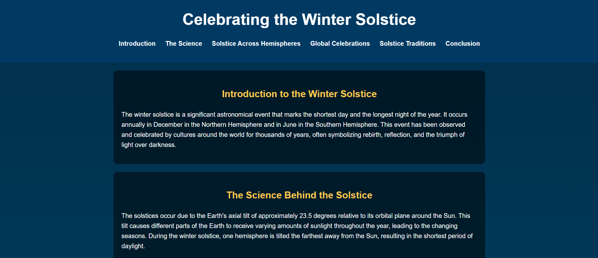

# Winter Solstice Celebrations Around the World

## Description
This project is a responsive and interactive landing page dedicated to exploring the science and cultural traditions surrounding the Winter Solstice. The page offers insights into the solstice's significance, how it's celebrated across different hemispheres, and its role in global traditions and folklore.

## Features
- **Sticky Navigation Bar**: Allows users to access different sections of the page easily.
- **Smooth Scrolling**: Enhances user experience with animated transitions between sections.
- **Responsive Design**: Ensures a seamless experience across devices of all sizes.
- **Interactive Highlights**: Highlights active sections in the navigation bar as users scroll through the page.
- **Engaging Visuals**: Uses gradients, contrasting colors, and a clean layout to present information effectively.

## Technologies Used
- **HTML**: Structured the content semantically for accessibility and SEO.
- **CSS**: Styled the page with responsive layouts, animations, and gradients.
- **JavaScript**: Added interactivity, including smooth scrolling and section tracking.

## Installation
1. Clone the repository:
   ```bash
   git clone https://github.com/your-username/winter-solstice-landing-page.git
   ```
2. Navigate to the project folder:
   ```bash
   cd winter-solstice-landing-page
   ```
3. Open `index.html` in your browser to view the project.

## Usage
Navigate through the various sections using the sticky navigation bar. Each section provides information on:
- The science behind the solstice.
- Differences in its observation across hemispheres.
- Global celebrations and traditions associated with the solstice.

## Preview
[Live Demo](https://dev-challenge-2024.vercel.app/)

## Future Enhancements
- Add multimedia elements like videos and interactive animations.
- Implement localization for multi-language support.
- Optimize for further performance improvements and accessibility.

## License
This project is licensed under the MIT License. Feel free to use and modify it as needed.
